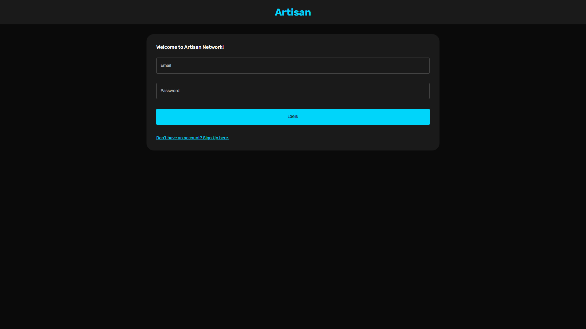

# Artisan Network - Inovando o conceito de rede social!
> - Projeto desenvolvido para o concurso Agrinho!
> - O projeto é totalmente funcional, desde criação de conta, login até pots
> - Desenvolvido com:

 
  
  
  
  
  
  

 

  <a href="https://caiolandgraf.github.io/artisan-network/">Acessar Projeto - Site</a>
  <a href="https://artisan-network-frontend.onrender.com">Acessar Projeto - Login Rede Social</a>

  
  
  
  

 

> -   Devs No Projeto
> [@caiolandgraf](https://github.com/caiolandgraf/)

---

> @Copyright [Caio Landgraf](https://github.com/caiolandgraf) - Todos Os Direitos Reservados!
